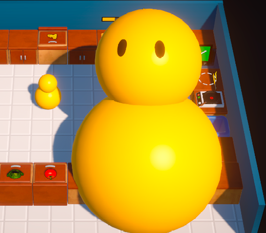

# Chaos In The Kitchen

[![LinkedIn][linkedin-shield]][linkedin-url]

  

  <h3 align="center">Chaos In The Kitchen</h3>

<!-- ABOUT THE PROJECT -->
## About The Project

Chaos In The Kitchen is developed in C# on Unity. It is a single player arcade game.
 
The aim of the game is to cook the food according to the recipe given to us and then deliver the prepared food. The number of orders delivered until the deadline is our score.

I made the game by watching the 10-hour training video of CodeMonkey on Youtube.
 
Here are some features of the game:
* Chop vegetables and cook meat
* Play easily with Handy control system
* Grab a plate and start filling it to order
  
### Images From Game
  
  
  

 ### Gameplay
https://github.com/Malii61/ChaosInTheKitchen/assets/92629282/9171ccd3-eb6a-4c76-a854-b09e698bfc05
  
### Installation
 <a>
    If you want to try the game, you can download it from <a href="https://github.com/Malii61/ChaosInTheKitchen/blob/main/Build"> this </a> link. After download open the Escape From Horror Mansion.exe file to run the game.

   
   
Project Link: [https://github.com/Malii61/ChaosInTheKitchen](https://github.com/Malii61/ChaosInTheKitchen)

[linkedin-shield]: https://img.shields.io/badge/-LinkedIn-black.svg?style=for-the-badge&logo=linkedin&colorB=555
[linkedin-url]: https://www.linkedin.com/in/muhammed-ali-tural/
 

